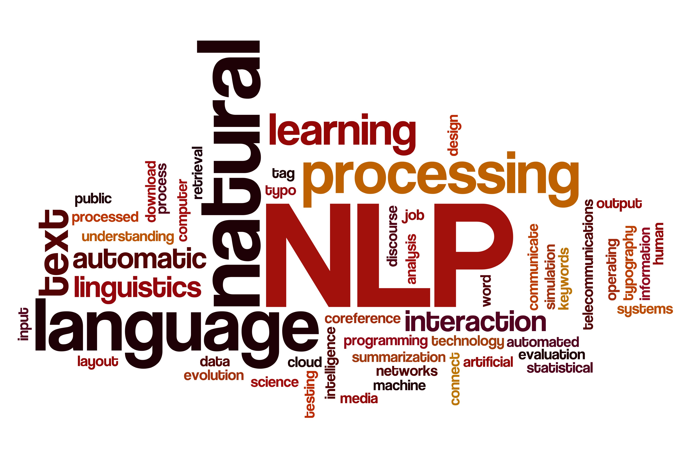

## NLP papers in 2020

### Description

This repository aims to collect papers which are accepted by top conferences in year 2020.

All the files and data are crawled from website such as https://coling2020.org/ or https://www.aclweb.org/portal/. 